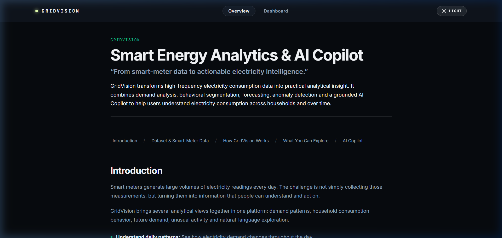
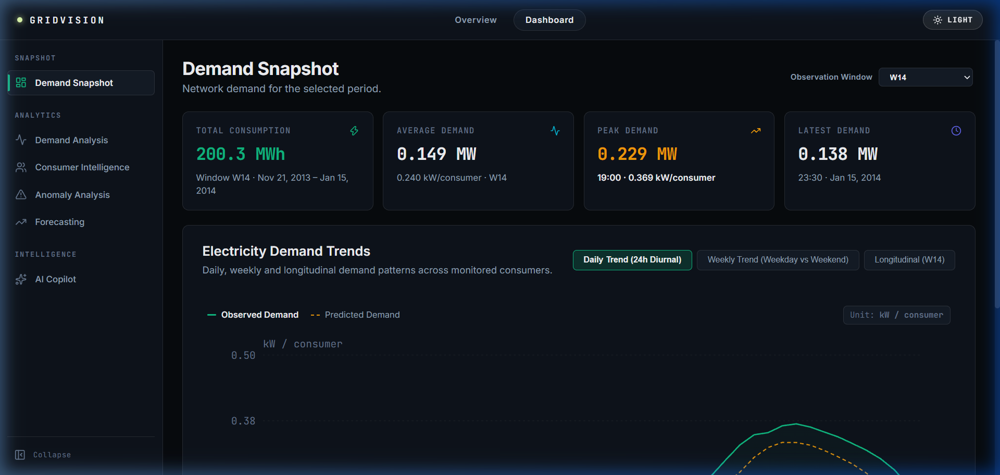
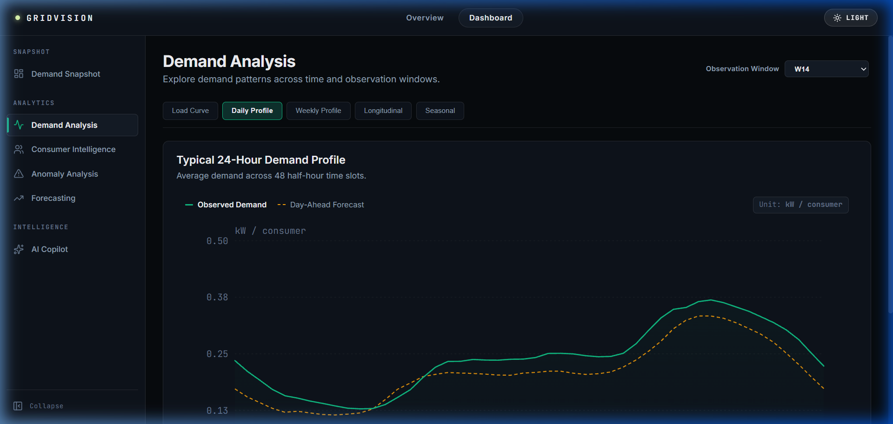
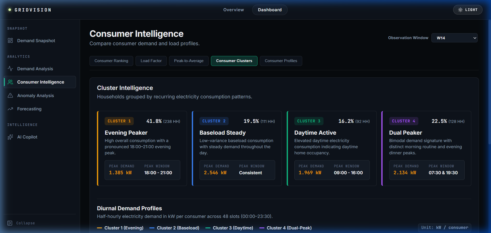
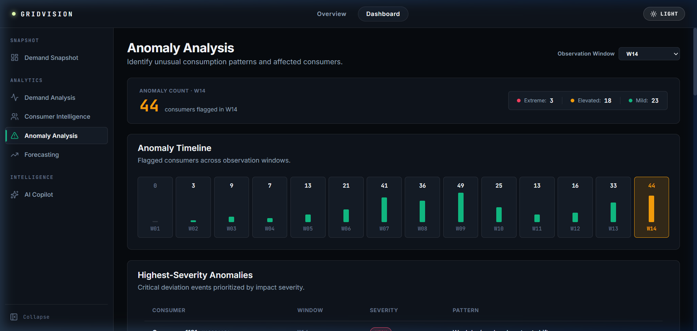
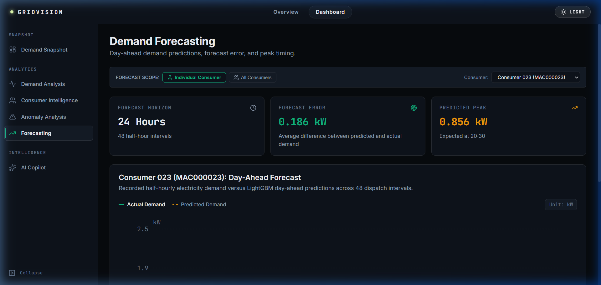
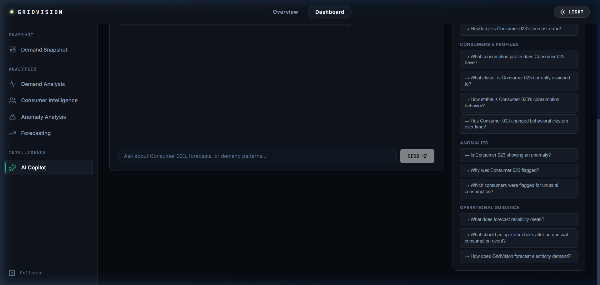

# GridVision — Smart Energy Analytics & AI Copilot

GridVision is an intelligent smart energy analytics platform and load forecasting system designed for electrical utilities, distribution network operators, and energy data analysts. Built on real-world smart-meter telemetry from the UK Power Networks Low Carbon London dataset, GridVision couples an offline machine learning pipeline with an interactive web dashboard and a grounded AI Operations Copilot to deliver longitudinal consumption insights, behavioral segmentation, anomaly screening, and reliable day-ahead demand forecasts.

---

## Overview

Modern electricity grids face growing operational volatility driven by shifting consumer habits, peak demand stress, and decentralized electrification. GridVision translates raw half-hourly smart meter readings into actionable operational intelligence through:

- **Portfolio-Scale Visibility:** Monitoring aggregate load trajectories, peak timing, and consumption trends across 14 longitudinal observation windows.
- **Consumer Behavioral Archetypes:** Segmenting households into distinct diurnal profiles using unsupervised clustering and temporal Hungarian tracking.
- **Proactive Anomaly Screening:** Detecting unusual consumption spikes, sudden drop-offs, and unexpected zero-reading periods using Isolation Forest with plain-language explanations.
- **Day-Ahead Load Forecasting:** Delivering accurate 24-hour demand projections powered by gradient-boosted regression and TreeSHAP explainability.
- **Verifiable AI Copilot:** Providing natural-language operational query capabilities with strict numeric grounding verification to prevent hallucinations.

---

## Key Features

- **Grid Overview:** Executive portfolio summary displaying total consumption (MWh), peak load demand, active anomaly counts, and cluster distributions across 14 observation windows.
- **Demand Analysis:** High-resolution diurnal load profiles across 48 half-hour slots (00:00 to 23:30), weekday vs. weekend comparisons, and longitudinal seasonal demand trends.
- **Consumer Intelligence:** Searchable meter directory filterable by peak demand, forecast error, anomaly count, or behavioral instability, featuring individual meter load curves and cluster trajectories.
- **Behavioral Segmentation:** 4 standardized consumption archetypes (*High Peak / Heavy Demand*, *Flat / Low-Variance*, *Daytime Active*, and *Moderate / Dual-Peak*) tracked across consecutive 56-day observation windows.
- **Anomaly Detection:** Unsupervised Isolation Forest screening that flags irregular meter behavior and provides feature-level z-score deviation explanations.
- **Demand Forecasting:** Gradient-boosted 24-hour load forecasting (MAE = 0.081 kW) outperforming seasonal-naive baselines, accompanied by TreeSHAP feature importance attributions.
- **AI Operations Copilot:** Natural-language assistant combining offline semantic retrieval with deterministic analytical tools, enforcing 100% strict numeric traceability on all emitted figures.

---

## System Architecture

GridVision separates offline analytical computation from online real-time serving through an artifact-driven architecture:

```text
┌─────────────────────────────────────────────────────────────────────────────┐
│                             RAW DATA INGESTION                              │
│         UK Power Networks Low Carbon London Smart-Meter Dataset             │
│        (5,566 Households → 4,443 Flat-Rate Standard Tariff Filtering)        │
└──────────────────────────────────────┬──────────────────────────────────────┘
                                       │
                                       ▼
┌─────────────────────────────────────────────────────────────────────────────┐
│                         DETERMINISTIC ML PIPELINE                           │
│  • Quality Gates: Zero-negative check, >=95% slot fill, <=3-day gap filter │
│  • 14 Fixed 56-Day Common-Calendar Windows (Nov 2011 – Feb 2014)            │
│  • Stratified Sampling: 620 Households across ACORN socioeconomic groups    │
│  • Behavioral Feature Extraction: 8 standardized load-shape dimensions      │
│  • K-Means (K=4) + Temporal Hungarian Label Alignment                       │
│  • Pooled HistGradientBoosting Demand Forecaster (MAE: 0.081 kW)            │
│  • Isolation Forest Anomaly Detection + Feature Deviation Scoring           │
│  • TreeSHAP Global Forecaster Interpretability Engine                       │
└──────────────────────────────────────┬──────────────────────────────────────┘
                                       │
                                       ▼
┌─────────────────────────────────────────────────────────────────────────────┐
│                         ANALYTICAL ARTIFACTS LAYER                          │
│     Static Parquet & JSON artifacts stored in data/artifacts/latest/        │
└──────────────────────────────────────┬──────────────────────────────────────┘
                                       │
                    ┌──────────────────┴──────────────────┐
                    ▼                                     ▼
┌──────────────────────────────────────┐  ┌──────────────────────────────────┐
│             BACKEND API              │  │        AI COPILOT SERVICE        │
│          (FastAPI / Python)          │  │ • Local TF-IDF Knowledge Store   │
│ • In-Memory Caching & Indexing       │  │ • Deterministic Analytical Tools │
│ • High-Speed PyArrow Queries         │  │ • Numeric Grounding Verifier     │
│ • Endpoints: /overview, /household/* │  │ • Optional Groq LLM Generation   │
└──────────────────┬───────────────────┘  └──────────────────┬───────────────┘
                   │                                         │
                   └───────────────────┬─────────────────────┘
                                       │
                                       ▼
┌─────────────────────────────────────────────────────────────────────────────┐
│                          INTERACTIVE WEB FRONTEND                           │
│                      (React 19 + TypeScript + Vite)                         │
│   Overview Gateway • Dashboard Workspaces • Chart.js • Glassmorphic UI      │
└─────────────────────────────────────────────────────────────────────────────┘
```

---

## Dataset

GridVision utilizes the **Low Carbon London** smart-meter dataset recorded by UK Power Networks:

- **Raw Meter Population:** 5,566 total residential smart meters recorded between November 2011 and February 2014.
- **Standard Tariff Filtering:** Filtered exclusively to 4,443 flat-rate households (`stdorToU == 'Std'`) to isolate intrinsic consumption behavior from dynamic pricing price-elasticity artifacts.
- **Working Analysis Cohort:** A stratified representative sample of **620 households** balanced across ACORN socioeconomic demographic groups (*Affluent*, *Adversity*, *Comfortable*, and protected *ACORN-U*).
- **Observation Windows:** 14 non-overlapping, 56-day (8-week) common-calendar windows yielding 6,191 valid household-window observation periods. Each window comprises 2,688 half-hour load observations.

---

## Machine Learning & Analytics

### 1. Behavioral Segmentation (K-Means)
- **Feature Vector:** 8 normalized behavioral metrics per meter per window (mean load, peak-to-mean ratio, morning peak ratio, evening peak ratio, night baseload ratio, load factor, weekend-to-weekday ratio, and normalized load variance).
- **Optimal K Selection:** K = 4 selected via calibration silhouette sweep with deterministic initialization (`random_state=42`).
- **Temporal Alignment:** Consecutive windows are aligned using the Hungarian algorithm (bipartite matching) to ensure consistent cluster identity over longitudinal sequences.

### 2. Demand Forecasting (Gradient Boosted Trees)
- **Model:** Pooled `HistGradientBoostingRegressor` trained on historical load lags, half-hour diurnal indicators, and calendar features.
- **Performance:** Achieves a mean absolute error (MAE) of **0.081 kW**, comfortably exceeding the seasonal-naive benchmark floor of **0.096 kW** (a 15.6% relative improvement).
- **Explainability:** Integrated TreeSHAP decomposes day-ahead forecasts into half-hour timing, day-of-week, and historical baseload attributions.

### 3. Anomaly Detection (Isolation Forest)
- **Model:** Unsupervised Isolation Forest (contamination = 0.05) operating on behavioral feature space.
- **Evaluation:** Validated against synthetic perturbation benchmarks (spikes, drops/vacations, erratic shifts, flatlines) achieving **ROC-AUC >= 0.95**.
- **Interpretability:** Attaches feature-level z-score deviations to explain whether an anomaly represents an evening surge, baseload flatline, or holiday drop.

---

## Dashboard Workspaces

1. **Overview Gateway:** Comprehensive introduction covering data origin, end-to-end processing architecture, and module workflows.
2. **Demand Snapshot:** Executive operational view displaying total MWh consumption, peak demand timing, average load, and active anomaly alerts across 14 observation windows.
3. **Demand Analysis:** 48-slot half-hourly diurnal load curves, weekday vs. weekend comparison charts, and multi-window longitudinal trajectory trends.
4. **Consumer Intelligence:** Interactive directory of all 620 monitored households with ranking options, individual load profiles, and longitudinal cluster migration histories.
5. **Anomaly Analysis:** Unsupervised anomaly timeline, severity distribution, triggering statistics, and specific operational remediation guidance.
6. **Demand Forecasting:** Day-ahead 24-hour load predictions comparing actual vs. predicted consumption, prediction interval bands, and SHAP feature importance.
7. **AI Operations Copilot:** Intelligent conversational assistant grounded in real-time grid metrics and domain knowledge.

---

## AI Operations Copilot

The GridVision AI Copilot assists grid operators by answering operational queries in plain natural language while maintaining complete mathematical truthfulness:

- **Dual-Path Architecture:** Combines offline retrieval over operational documentation with deterministic tool execution directly bound to precomputed pipeline artifacts.
- **Strict Numeric Traceability:** Every numeric figure emitted in a response is extracted and verified against the underlying tool data or retrieved text chunks. If an unsupported number is detected, the response is explicitly flagged as ungrounded to protect decision-making integrity.
- **Offline Fallback:** If an external LLM API key is not configured, the Copilot automatically serves structured, deterministic analytical summaries with zero loss of accuracy.

---

## Screenshots

### Overview Gateway


### Grid Dashboard & Snapshot


### Demand Analysis


### Consumer Intelligence


### Anomaly Analysis


### Demand Forecasting


### AI Copilot


---

## Tech Stack

| Layer | Technologies |
| :--- | :--- |
| **Frontend** | React 19, TypeScript, Vite, Chart.js, Lucide Icons, Glassmorphic CSS |
| **Backend** | FastAPI, Uvicorn, Pydantic, PyArrow, Pandas, NumPy |
| **Machine Learning** | Scikit-learn, SHAP, LightGBM / HistGradientBoosting |
| **AI & NLP** | TF-IDF Vectorizer (Local RAG), Groq API (Optional LLM inference) |
| **Data Storage** | Apache Parquet, JSON |
| **Testing** | Pytest, FastAPI TestClient |

---

## Running Locally

### Prerequisites
- Python 3.10+
- Node.js 18+ and npm

### 1. Clone the Repository
```bash
git clone https://github.com/prashant25gourav/gridvision-sic.git
cd gridvision-sic
```

### 2. Set Up Python Environment
```bash
# Create and activate virtual environment
python -m venv venv

# Windows:
.\venv\Scripts\activate
# Linux/macOS:
source venv/bin/activate

# Install Python dependencies
pip install -r requirements.txt
```

### 3. Configure Environment Variables
Copy the environment template:
```bash
cp .env.example .env
```
*(Optional: add `GROQ_API_KEY=your_key_here` if you wish to use cloud LLM inference for the Copilot. The system operates fully offline without it.)*

### 4. Execute the ML Pipeline (Optional)
The repository includes precomputed artifacts in `data/artifacts/latest/`. To re-run the deterministic pipeline from scratch:
```bash
python -m pipeline.run_pipeline
```

### 5. Start the FastAPI Backend
```bash
uvicorn app.main:app --app-dir backend --reload --port 8000
```
- Health Check: `http://localhost:8000/health`
- Interactive API Documentation: `http://localhost:8000/docs`

### 6. Start the React Frontend
In a new terminal:
```bash
cd frontend
npm install
npm run dev
```
Open [http://localhost:5173](http://localhost:5173) in your browser.

---

## Environment Variables

| Variable | Description | Default |
| :--- | :--- | :--- |
| `PROJECT_NAME` | Name displayed in API documentation | `"GridVision API"` |
| `API_V1_STR` | Root path prefix for REST endpoints | `"/api/v1"` |
| `BACKEND_CORS_ORIGINS` | Permitted CORS origins (comma-separated) | `"http://localhost:5173,http://127.0.0.1:5173"` |
| `GROQ_API_KEY` | Optional API key for natural language Copilot generation | *None (local deterministic fallback enabled)* |

---

## Project Structure

```text
gridvision-sic/
├── backend/                  # FastAPI backend service
│   ├── app/
│   │   ├── api/v1/endpoints/ # API routers (/overview, /household, /chat)
│   │   ├── services/         # Artifact loader & RAG Copilot orchestration
│   │   └── main.py           # Application entrypoint & CORS configuration
│   └── tests/
├── frontend/                 # React + TypeScript + Vite frontend
│   ├── src/
│   │   ├── components/       # Overview gateway, dashboard workspaces, charts
│   │   ├── services/         # Typed API client
│   │   ├── types/            # TypeScript data models
│   │   └── App.tsx           # Application navigation root
│   └── package.json
├── pipeline/                 # Deterministic ML & data processing pipeline
│   ├── ingestion/            # Raw smart meter ingestion and filtering
│   ├── quality/              # Data completeness and validation checks
│   ├── windows/              # 14 common-calendar 56-day window partitioning
│   ├── features/             # 8-dimensional behavioral feature extraction
│   ├── clustering/           # K-Means clustering and Hungarian alignment
│   ├── forecasting/          # GBDT demand forecaster and error standardization
│   ├── anomaly/              # Isolation Forest anomaly screening
│   ├── explainability/       # TreeSHAP feature attributions
│   └── run_pipeline.py       # Pipeline execution entrypoint
├── config/                   # Pipeline configuration YAML
├── data/
│   └── artifacts/latest/     # Precomputed Parquet and JSON artifacts
├── docs/
│   └── screenshots/          # Application screenshot gallery
├── tests/                    # Automated unit and integration test suite
├── .env.example              # Environment variables template
├── requirements.txt          # Python dependencies
└── README.md
```

---

## Limitations

- **Dataset Historical Context:** The Low Carbon London dataset spans 2011 to 2014. While structurally representative of residential demand, it does not reflect modern high-penetration residential solar PV, home battery systems, or dynamic electric vehicle (EV) smart charging.
- **Interval Resolution:** GridVision is optimized for 30-minute smart-meter settlement intervals (standard in UK energy markets) rather than second-by-second SCADA or distribution automation telemetry.

---

## Future Improvements

- **Sub-Hourly Telemetry Support:** Extending feature extractors and forecasters to handle 5-minute and 15-minute intervals.
- **Behind-the-Meter Solar Disaggregation:** Incorporating photovoltaic generation estimation to separate gross household load from net grid demand.
- **Automated Demand Response Dispatch:** Integrating flexibility scoring to identify consumers with high shifting potential for peak curtailment events.

---

## License

This project is licensed under the MIT License — see the [LICENSE](LICENSE) file for details.