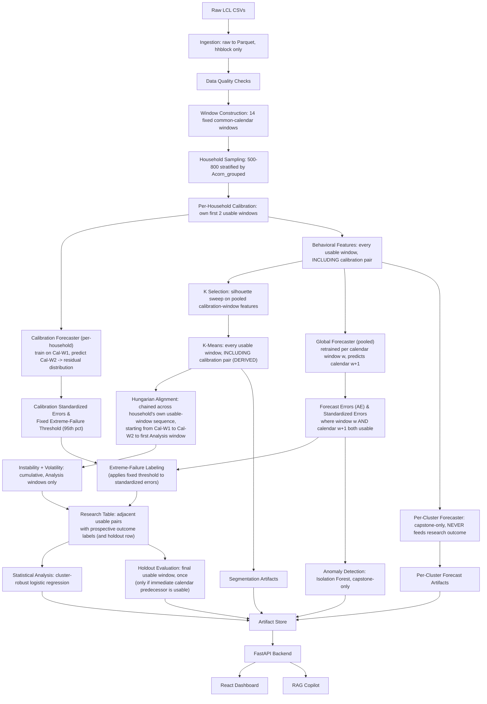

# GridVision — Implementation Blueprint v2 (Self-Audited)

> Engineering specification derived from `GridVision_FINAL_MASTER_PLAN_v4.docx` (authoritative) and `GridVision_AI_HANDOFF_CONTEXT_LOCKED.md` (portable context). Where sources conflict, v4 wins. This version corrects methodological gaps found in a full self-audit of v1 and simplifies engineering complexity that wasn't earning its keep.

**Legend:** `LOCKED` = fixed by v4. `PROPOSED` = practical choice not specified by v4. `DERIVED` = not stated verbatim in v4, but the only implementation consistent with v4's explicit pipeline text and formulas — not a free choice. `OPEN` = genuine ambiguity that v4 does not settle and cannot be derived from it. `DEPENDENCY` = hard prerequisite.

---

## Blueprint Revision Log

### Methodology Corrections

| Section | Previous interpretation (v1) | Corrected interpretation (v2) | Reason |
|---|---|---|---|
| Cluster assignment during calibration (§C.5, §D.2) | Flagged `OPEN`, offered a "recommendation" as if it were a free choice | Reclassified `DERIVED`: **both calibration windows receive K-Means cluster labels** (fixed K) | v4 §4.3 requires Hungarian alignment of the first Analysis window against "that household's previous window." For the first Analysis window, that previous window *is* Calibration Window 2 — it cannot be aligned against something with no cluster label. This is not a preference; it's the only implementation the locked pipeline text supports. It also matches v4's own limitation language about the first Analysis window's instability resting on "very few observed transitions" — consistent with 2 transitions (Cal-W1→Cal-W2, Cal-W2→first Analysis window), not 1. |
| Non-adjacent usable windows (§C.14 point 3, §D.6) | Flagged `OPEN`, pseudocode already dropped non-adjacent pairs but the status label implied it was still an unresolved team decision | Reclassified `DERIVED`: research-table rows require `window_w_plus_1` to be the literal **calendar** successor of `window_w`, *and* usable for that household; if not, the row is dropped, not substituted with the household's next usable window | v4 §4.2/§4.3 define the forecasting target as "window w+1," where the global forecaster is retrained per **calendar** step and "predicts window w+1" — not "predicts the household's next usable window." AE literally cannot be computed without real half-hourly readings in that specific calendar window. Substituting a later usable window would silently redefine what "w+1" means, which v4 does not authorize. |
| Calibration forecaster vs. global forecaster boundary (§D, new §D.4) | No dedicated module contract existed for `calibration_forecast.py`; it was only described in the repo tree and the pipeline table, with no signature or leakage guard distinguishing it from the pooled global forecaster | Added a full module contract (new §D.4) with an explicit, standalone per-household training function and a dedicated leakage assertion/test | v4 §4.3 specifies the calibration forecaster is trained **only on one household's own Calibration Window 1**, predicting only that household's own Calibration Window 2 — structurally different from the global forecaster (pooled across all households, retrained per calendar window). Without an explicit, separate contract, an implementer could plausibly (and incorrectly) reuse the pooled training loop for calibration, silently leaking cross-household information into what must be a per-household baseline. |
| Instability transition counting (§C.6, §D.3) | Grain and transition counting logic didn't explicitly account for calibration-window transitions | Clarified: the transition history used in Persistence/Instability includes the Cal-W1→Cal-W2 transition, even though calibration windows themselves never appear as a `window_w` row in the research table | Consistent with the `DERIVED` decision above — calibration windows are "usable windows" per v4's own definition of the calibration pair ("a household's own first 2 *usable* windows"), so they belong in "h's own usable windows" that the Persistence formula operates over. |
| Forecast-table row eligibility (§C.11) | Implied predictions might exist without checking whether the source data needed to build lag features was actually usable | Clarified: a research-table row for `(h, w, w+1)` requires window `w` usable (lag features) **and** window `w+1` usable (outcome) for that household | v4's "known at time t" table lists window `w`'s data as the basis for the forecast of `w+1`; if `w` itself is a data-quality gap for household h, no valid forecast/AE exists for that pair either. |

### Engineering Improvements (no methodology change)

| Section | Previous (v1) | Simplified (v2) | Reason |
|---|---|---|---|
| Artifact versioning (`pipeline/registry.py`) | A "content-hash tracking" registry implying selective, dependency-aware partial reruns | Replaced with a plain timestamped run directory (`data/artifacts/run_<timestamp>/`), a `latest` symlink, and one `run_manifest.json` per run recording git commit, config hash, and seeds | A dependency-aware rerun system is unnecessary engineering for a 4-person, 20-day capstone: `make pipeline` just reruns everything and is fast enough (§12 verified runtimes are all under 2 minutes). Reproducibility is preserved via the manifest; the smart partial-rerun machinery was complexity without a corresponding need. |
| Example API values (§F) | Illustrative JSON values (household IDs, MAE numbers) were not visually distinguished from real results | Every illustrative value is now explicitly tagged `ILLUSTRATIVE ONLY — NOT PROJECT RESULTS` | Prevents a teammate or reader from mistaking a made-up example (`"mae_global": 0.081`) for an actual verified result. |
| RAG grounding check | Already minimal; kept as-is | No change | On review, the numeric-token-extraction grounding check is already the smallest mechanism that does the job — not flagged for simplification. |

### Remaining OPEN Decisions

Only one genuine item remains, and it is cosmetic, not methodological:

- **UI reliability-indicator bucketing** (§F.4): the thresholds used to label a household "stable" / "moderate" / "elevated risk" in the dashboard are a display convenience, not derived from the statistical model. This needs a one-line team confirmation that it will never be referenced in the research write-up, but it does not block implementation and has no correct/incorrect answer to derive from v4.

There are **no remaining unresolved methodological ambiguities** after this audit. Both items flagged `OPEN` in v1 (calibration-window clustering, non-adjacent windows) were found to be logically settled by v4's own text once traced through carefully, and are now documented as `DERIVED` rather than left as team decisions.

---

## A. System Architecture

### A.1 Two pipelines, not one app

Unchanged from v1. GridVision has an **offline research/ML pipeline** (produces static artifacts) and an **online application** (FastAPI + React, serves those artifacts). `LOCKED`: the app never re-runs clustering, alignment, or forecasting on demand.

| | Offline pipeline | Online app |
|---|---|---|
| Runs | Once per full run, on demand (`make` targets, §K) | Continuously, serving requests |
| Owns | Data quality, calibration, clustering, alignment, forecasting, statistics | `/forecast`, `/segment`, `/instability`, `/anomaly`, `/chat` |
| Rerun cost | Minutes (§12 verified runtimes) | N/A — reads Parquet/JSON artifacts |
| Output | `data/artifacts/run_<timestamp>/` | HTTP responses from `data/artifacts/latest` |

### A.2 End-to-end flow (updated: calibration windows now feed clustering too)



### A.3 Execution granularity

Unchanged from v1, with one simplification: no dependency-aware partial reruns. `make pipeline` reruns the full offline sequence; this is intentionally simple (see Engineering Improvements above) because the full pipeline already runs in minutes.

---

## B. Repository Structure

```
gridvision/
├── data/
│   ├── raw/                        # gitignored, deleted after conversion
│   ├── interim/
│   └── artifacts/
│       ├── run_<timestamp>/        # one directory per pipeline run, contains run_manifest.json
│       └── latest -> run_<timestamp>
│
├── pipeline/
│   ├── ingestion/
│   │   ├── to_parquet.py           # [P1]
│   │   └── metadata.py             # [P1]
│   ├── quality/
│   │   ├── checks.py               # [P1]
│   │   └── report.py               # [P1]
│   ├── windows/
│   │   ├── calendar.py             # 14 fixed windows [P1]
│   │   ├── eligibility.py          # per household-window usability [P1]
│   │   └── calibration_select.py   # per-household own first-2-usable-windows [P1]
│   ├── sampling/
│   │   └── stratified_sample.py    # [P1]
│   ├── features/
│   │   └── behavioral.py           # runs on EVERY usable window, incl. calibration pair [P1]
│   ├── clustering/
│   │   ├── k_selection.py          # silhouette sweep on pooled calibration features [P1]
│   │   ├── kmeans_fit.py           # runs on EVERY usable window, incl. calibration pair [P1]
│   │   └── alignment.py            # chains through the household's full usable sequence [P1]
│   ├── instability/
│   │   └── metrics.py              # Analysis windows only; counts calibration-pair transition [P1]
│   ├── forecasting/
│   │   ├── calibration_forecast.py # PER-HOUSEHOLD, Cal-W1 -> Cal-W2 only. See §D.4. [P2]
│   │   ├── global_forecaster.py    # POOLED, feeds research outcome. See §D.5. [P2]
│   │   ├── cluster_forecaster.py   # per-cluster, CAPSTONE ONLY. See §D.6. [P2]
│   │   └── error_standardization.py# AE, StdError, MAD floor [P2]
│   ├── research/
│   │   ├── build_research_table.py # calendar-adjacent, both-usable pairs only. See §D.7. [P2]
│   │   ├── extreme_failure.py      # [P2]
│   │   ├── statistical_model.py    # [P2]
│   │   └── holdout_eval.py         # [P2]
│   ├── anomaly/
│   │   ├── isolation_forest.py     # [P3]
│   │   ├── synthetic_injection.py  # [P3]
│   │   └── explain.py              # [P3]
│   ├── explainability/
│   │   └── shap_forecaster.py      # global forecaster only [P3]
│   └── run_pipeline.py             # CLI entrypoint; writes run_<timestamp>/ + run_manifest.json [P1]
│
├── backend/                        # [P4] — unchanged from v1
│   ├── app/
│   │   ├── main.py
│   │   ├── routers/{forecast,segment,instability,anomaly,chat}.py
│   │   ├── services/{artifact_loader.py, rag/{index,retriever,tools}.py}
│   │   ├── schemas/
│   │   └── config.py
│   └── knowledge_base/
│
├── frontend/                       # [P4] — unchanged from v1
│   └── src/{pages,components,api,types,state}/
│
├── tests/
│   ├── pipeline/                   # includes new calibration-isolation and adjacency tests
│   ├── backend/
│   ├── frontend/
│   └── e2e/
│
├── config/
│   ├── pipeline.yaml
│   └── .env.example
│
├── docs/
├── Makefile
└── README.md
```

**Removed from v1:** `pipeline/registry.py` (content-hash dependency tracking) — replaced by the plain `run_manifest.json` written directly by `run_pipeline.py`. This is the only structural removal; everything else is additive or clarifying.

---

## C. Data Contracts and Schemas

Only the schemas that changed are reproduced in full below. Unchanged schemas (`households_sampled.parquet`, `window_eligibility.parquet`, `calibration_assignment.parquet`, `calibration_residuals.parquet`, `calibration_summary.parquet`, `extreme_failure_threshold.json`, `statistical_results.json`, `anomaly_flags.parquet`, `shap_explanations.parquet`) carry over from v1 unchanged — see v1 for their full definitions if needed; they were re-audited and found correct.

### C.5 `cluster_assignments.parquet` — **updated grain**

- **Grain (corrected):** one row per (household, **usable window**) — this now explicitly **includes both calibration windows**, not Analysis windows only.
- **Producing module:** `pipeline/clustering/kmeans_fit.py` → `pipeline/clustering/alignment.py`

| Field | Type | Nullable |
|---|---|---|
| `household_id` | string | no |
| `window_id` | string | no |
| `window_role` | string | no | **new field** — `"calibration_1"`, `"calibration_2"`, `"analysis"`, or `"holdout"` |
| `raw_cluster_label` | int | no | K-Means output before alignment |
| `aligned_cluster_label` | int | no | after Hungarian alignment to the household's own previous *usable* window |
| `centroid_distance` | float | no | diagnostic only |

`DERIVED` (resolved from v1's `OPEN`): calibration windows get real K-Means labels using the fixed K, exactly like Analysis windows, because the first Analysis window's Hungarian alignment step requires a previous window with a cluster label — and that previous window is Calibration Window 2. See Revision Log. The very first calibration window (`calibration_1`) keeps its raw label as its aligned label (nothing precedes it to align against).

### C.6 `instability_volatility.parquet` — **clarified, grain unchanged**

- **Grain:** one row per (household, window), **Analysis windows only** (unchanged — calibration windows never appear here as a scored row, since they are never used as a `window_w` predictor).
- **Clarification (new):** the `n_transitions_observed` and `n_cluster_changes` counters **include the Cal-W1→Cal-W2 transition** in their running count, even though that transition itself doesn't produce a row in this table. Concretely, the first Analysis window's row has `n_transitions_observed = 2` (Cal-W1→Cal-W2, Cal-W2→first Analysis window), not 1.

| Field | Type | Nullable |
|---|---|---|
| `household_id` | string | no |
| `window_id` | string | no |
| `n_transitions_observed` | int | no | includes the calibration-pair transition |
| `n_cluster_changes` | int | no | includes the calibration-pair transition |
| `persistence` | float | no | `1 - n_cluster_changes / n_transitions_observed` |
| `instability` | float | no | `1 - persistence` |
| `volatility_cv` | float | no | coefficient of variation, household's own windows 1..w (including calibration windows' readings) |

### C.9 `research_table.parquet` — **clarified row-eligibility rule**

Schema unchanged from v1 (see below), but the eligibility rule is now explicit and `DERIVED` rather than an implementation guess:

**Row eligibility (DERIVED, replaces v1's `OPEN` note):** a row for `(household_id, window_w, window_w_plus_1)` exists **only if**:
1. `window_w_plus_1` is the literal **calendar** successor of `window_w` (e.g., `w=W05 → w_plus_1=W06`, never `W07`), and
2. both `window_w` and `window_w_plus_1` are individually usable for that household (per `window_eligibility.parquet`), and
3. `window_w` is one of that household's own Analysis windows (i.e., strictly after its calibration pair and not its own Holdout window).

If a household has usable W05 and W07 but unusable W06, **no row is produced for that pair** — the household simply has one fewer observation in the research table. It resumes contributing rows from whichever later window-pair is both calendar-adjacent and usable.

**Holdout predecessor eligibility rule (Issue 4):**
For each household's single holdout evaluation (`is_holdout = True`), the household's final usable window is its holdout target. It may **only** be evaluated if its immediately preceding calendar window (`w_pred = calendar_predecessor(w_target)`) is usable and provides valid forecast context. Never substitute an earlier non-adjacent usable window. If the immediate calendar predecessor is unavailable or unusable, the holdout evaluation for that household is marked ineligible (no non-adjacent forecast pair is ever constructed).

| Field | Type | Nullable | Notes |
|---|---|---|---|
| `household_id` | string | no | |
| `window_w` | string | no | the predictor window (for holdout row: immediate calendar predecessor) |
| `window_w_plus_1` | string | no | the outcome window — always `window_w`'s calendar successor |
| `instability` | float | no | from C.6, at window w |
| `volatility_cv` | float | no | from C.6, at window w |
| `ae` | float | no | mean AE across window w+1's half-hourly predictions, GLOBAL forecaster only |
| `std_error` | float | no | standardized against household's own `calibration_summary` |
| `is_extreme_failure` | bool | no | `std_error > global_threshold_95th` (labeled using fixed threshold from `extreme_failure_threshold.json`, pre-computed from calibration residuals) |
| `acorn_grouped` | string | no | reference only |
| `is_holdout` | bool | no | true only for each household's single holdout row (evaluated only if immediate calendar predecessor was usable) |

### C.11 `forecast_global.parquet`, `forecast_percluster.parquet` — **clarified**

Schema unchanged from v1. Added clarification: the global forecaster may in principle produce a prediction for any household's calendar window `w+1` once trained up to `w`, but a row only becomes usable in `research_table.parquet` when window `w` itself was also usable for that household (needed for its lag features) — see C.9 rule 2. `forecast_global.parquet` itself is not filtered by this rule (it can retain predictions even for households whose `w` was borderline); the filtering happens at the `research_table.parquet` join step, so the raw forecast artifact stays a complete, unfiltered audit trail.

### C.14 Cross-cutting consistency rules — **updated**

1. Every table keyed by `household_id` must only contain IDs present in `households_sampled.parquet`.
2. Every `window_id` must be one of the 14 `LOCKED` calendar windows.
3. **(Resolved, was OPEN in v1)** `window_w_plus_1` is always the literal calendar successor of `window_w` — never the household's next usable window. Non-adjacent usable-window pairs simply do not produce a research-table row. See C.9.
4. **(New)** `cluster_assignments.parquet` rows exist for calibration windows too (`window_role` distinguishes them) — do not filter this table to Analysis windows only when computing alignment; do filter to Analysis windows only when reading it for `instability_volatility.parquet` or for UI trajectory display, unless the UI intentionally wants to show the calibration windows as part of the trajectory (a `PROPOSED`, cosmetic display choice, not a methodology point).

---

## D. Module-Level Implementation Contracts

D.1 (`calibration_select.py`) and D.2 (renamed from v1's alignment section, now reflecting the extended scope) are updated; a new D.4 is inserted for the calibration forecaster; subsequent modules are renumbered accordingly.

### D.1 `pipeline/windows/calibration_select.py`
Unchanged from v1 — already correct. Identifies each household's own first 2 usable windows (calibration pair), first Analysis window, and Holdout window.

### D.2 `pipeline/clustering/alignment.py` — **updated scope**
- **Responsibility:** Hungarian-algorithm cluster alignment, chained across a household's **entire usable-window sequence, starting from its own first calibration window**, not starting at the first Analysis window.
- **Suggested signature (updated):**
```python
def align_household_trajectory(
    raw_labels: pd.DataFrame,   # one household, ALL usable windows incl. calibration pair, ordered
    centroids: dict[int, np.ndarray],  # cluster_id -> centroid, fixed K
) -> pd.DataFrame:
    """
    window_role sequence is: calibration_1, calibration_2, analysis..., holdout (last).
    For window i (i>0 in this full sequence):
      cost_matrix[a, b] = euclidean(centroid_of_label_a_at_window_i-1,
                                      centroid_of_label_b_at_window_i)
      relabel window i using scipy.optimize.linear_sum_assignment
    window i=0 (calibration_1) keeps its raw label (nothing precedes it).
    """
```
- **Invariant:** alignment never crosses households; the permutation is a bijection over the fixed K labels; calibration windows are included in the chain (this is the corrected behavior — v1 started the chain at the first Analysis window, which left it with nothing to align the first Analysis window against).
- **Tests required:** same as v1, plus a new test confirming the alignment chain includes the calibration pair (a 4-window synthetic sequence: `calibration_1, calibration_2, analysis_1, analysis_2` with shuffled raw labels → aligned labels constant throughout).
- **Owner:** P1.

### D.3 `pipeline/instability/metrics.py` — **clarified transition counting**
- **Responsibility:** unchanged formula, but the transition history now explicitly starts at the calibration pair.
```python
def compute_instability(aligned_labels_full_sequence: pd.Series) -> pd.DataFrame:
    """
    aligned_labels_full_sequence: ordered calibration_1, calibration_2, analysis_1, analysis_2, ...
    Transitions are counted starting from calibration_1 -> calibration_2.
    Only ANALYSIS windows get an output row (calibration windows are consumed
    into the running transition count but never scored themselves).
    First Analysis window's row: n_transitions_observed = 2.
    """
```
- **Tests required:** same as v1 (constant-label / alternating-label sequences), plus a new test asserting the first Analysis-window row has `n_transitions_observed == 2`, not 1.
- **Owner:** P1.

### D.4 `pipeline/forecasting/calibration_forecast.py` — **new, previously missing a contract**
- **Responsibility:** train a forecaster on **exactly one household's own Calibration Window 1**, predict that same household's Calibration Window 2, and derive its calibration residual distribution. `LOCKED` (v4 §4.3): this is per-household, never pooled.
- **Inputs:** `behavioral` half-hourly readings for one household's `calibration_window_1` and `calibration_window_2` (from `calibration_assignment.parquet`).
- **Outputs:** `calibration_residuals.parquet` rows (per half-hourly slot), aggregated into `calibration_summary.parquet` (median AE, MAD, MAD-floor flag).
- **Suggested signature:**
```python
def calibrate_household(household_id: str, cal_w1_readings: pd.DataFrame, cal_w2_readings: pd.DataFrame) -> tuple[pd.DataFrame, dict]:
    """
    model = train_simple_forecaster(cal_w1_readings)   # THIS household's data only
    predictions = model.predict(cal_w2_readings.timestamps)
    residuals = abs(cal_w2_readings.actual - predictions)
    summary = {
        "calibration_median_ae": median(residuals),
        "calibration_mad": mad(residuals),
        "mad_effective": max(mad(residuals), 0.05 * median(residuals)),
        "mad_floor_triggered": mad(residuals) < 0.05 * median(residuals),
    }
    return residuals_table, summary
    """
```
- **Critical invariant (leakage-critical, new explicit rule):** this function must be called **once per household, independently**, with inputs restricted to that single household's own two calibration windows. It must **never** import or call anything from `global_forecaster.py`, and must never receive pooled multi-household training data. This is enforced by:
  1. A static-import check test asserting `calibration_forecast.py` does not import `global_forecaster.py` or vice versa.
  2. A runtime assertion that the training dataframe passed in contains exactly one distinct `household_id`.
- **Model choice:** `PROPOSED` — a lightweight model (e.g., a small LightGBM with the same lag/calendar feature set as the global forecaster, or even a simpler seasonal-naive-plus-residual model) is sufficient here; v4 does not mandate a specific algorithm for the calibration forecaster, only that it is trained on Window 1 and evaluated on Window 2. Using the same LightGBM implementation as the global forecaster (just fit per-household instead of pooled) is the simplest consistent choice and is recommended.
- **Owner:** P2.

### D.5 `pipeline/forecasting/global_forecaster.py` (renumbered from v1's D.4)
Unchanged from v1 — already correctly specified as pooled, retrained per calendar window `w`, predicting calendar `w+1`, with the `train_data.window <= w` leakage assertion.

### D.6 `pipeline/forecasting/cluster_forecaster.py` (renumbered from v1's D.5)
Unchanged from v1 — capstone-only, static-import check confirms `build_research_table.py` never imports from it.

### D.7 `pipeline/research/build_research_table.py` (renumbered from v1's D.6) — **updated pseudocode**
```python
def build_holdout_row(household, global_threshold_95th):
    """
    Holdout row builder with predecessor eligibility check (Issue 4).
    The final usable window is the household's holdout target.
    It may ONLY be evaluated if its immediately preceding calendar window
    is usable and provides valid forecast context.
    Never substitute an earlier non-adjacent usable window.
    If the immediate calendar predecessor is unavailable/unusable, mark ineligible.
    """
    w_target = household.last_usable_window
    w_pred = calendar_predecessor(w_target)
    if w_pred is None or not is_usable(household, w_pred):
        # Predecessor unavailable or unusable -> ineligible for holdout evaluation
        return None  # No non-adjacent pair is constructed

    ae = mean_ae_global_forecaster(household, w_target)
    std_error = standardize(household, ae)
    return {
        "household_id": household.id,
        "window_w": w_pred,
        "window_w_plus_1": w_target,
        "instability": instability_at(household, w_pred),
        "volatility_cv": volatility_at(household, w_pred),
        "ae": ae,
        "std_error": std_error,
        "is_extreme_failure": std_error > global_threshold_95th,
        "acorn_grouped": household.acorn_grouped,
        "is_holdout": True,
    }

rows = []
for household in sampled_households:
    analysis_seq = analysis_windows_in_order(household)  # excludes calibration pair and holdout
    for w in analysis_seq:
        w_plus_1 = calendar_successor(w)  # LITERAL calendar successor, never "next usable"
        if w_plus_1 is None:
            continue  # w was the last calendar window, no successor exists
        if not is_usable(household, w) or not is_usable(household, w_plus_1):
            continue  # DERIVED rule from C.9 — drop, do not substitute a different window
        if w == household.last_usable_window:
            continue  # that window is reserved for the Holdout row, built separately
        ae = mean_ae_global_forecaster(household, w_plus_1)
        std_error = standardize(household, ae)
        row = {
            "household_id": household.id, "window_w": w, "window_w_plus_1": w_plus_1,
            "instability": instability_at(household, w),
            "volatility_cv": volatility_at(household, w),
            "ae": ae,
            "std_error": std_error,
            "is_extreme_failure": std_error > global_threshold_95th,
            "acorn_grouped": household.acorn_grouped,
            "is_holdout": False,
        }
        rows.append(row)
    holdout_row = build_holdout_row(household, global_threshold_95th)
    if holdout_row is not None:
        rows.append(holdout_row)
```
- **Owner:** P2.

---

## E. ML and Research Pipeline — Exact Executable Sequence (updated)

The exact dependency sequence is acyclic and strictly ordered:
1. Calibration forecasts
2. Calibration residuals
3. Calibration standardized-error distribution
4. Fixed extreme-failure threshold (`extreme_failure_threshold.json`)
5. Analysis/holdout forecast errors (AE)
6. Standardized errors
7. Extreme-failure labels
8. Research table (`research_table.parquet`)
9. Statistical analysis (`statistical_results.json`)
10. Holdout evaluation (`holdout_results.json`)

The extreme-failure threshold is computed once from the pooled calibration standardized-error distribution and fixed BEFORE research-table outcomes are labelled. The research table contains the outcome generated by the threshold, so the threshold cannot depend on the completed research table.

| Stage | Info available | Must NOT use | Artifact produced | Leakage check |
|---|---|---|---|---|
| Calibration forecast | **One household's own** Calibration Window 1 only | Calibration Window 2, any Analysis window, **any other household's data** | `calibration_residuals.parquet`, `calibration_summary.parquet` | Runtime assertion: training data has exactly 1 distinct `household_id`; static-import check vs. `global_forecaster.py` (§D.4) |
| Extreme-failure threshold | Pooled **calibration** StdError distribution only | Any Analysis/Holdout residuals or errors | `extreme_failure_threshold.json` | Computed and fixed strictly from calibration residuals before any Analysis-window outcome is labeled; never recomputed |
| K selection | Behavioral features from all households' own **calibration windows** (pooled across households, both calibration windows) | Any Analysis-window features | fixed `K` | Assert silhouette input rows' `window_role ∈ {"calibration_1","calibration_2"}` |
| Clustering (all usable windows, including calibration pair) | Window's own behavioral features, fixed K | Any other window's features | `cluster_assignments.parquet` (raw) — now includes calibration rows | One `.fit_predict` call per window, no cross-window fitting |
| Cluster alignment | Household's own previous **usable** window in the full sequence (starting from calibration_1) | Any other household's centroids/labels | `cluster_assignments.parquet` (aligned) | Cost matrix built from exactly 2 windows, same household, consecutive in that household's own usable sequence |
| Instability/volatility at `w` (Analysis windows only) | That household's own usable windows from calibration_1 through `w` | Window `w+1` or later | `instability_volatility.parquet` | Max `window_id` used ≤ `w`; transition count includes calibration-pair transition |
| Global forecast for calendar `w+1` | Pooled data across all households, up to end of calendar `w` | Window `w+1` actuals, any window `> w` | `forecast_global.parquet` | `train_data.window <= w` (§D.5) |
| Research-table row assembly & extreme-failure labeling | Window `w` and calendar `w+1` both usable; pre-fixed extreme-failure threshold; holdout predecessor checked | Substituting non-adjacent "next usable" window; using uncalibrated thresholds | `research_table.parquet` rows | `window_w_plus_1 == calendar_successor(window_w)` strictly; holdout row requires immediate calendar predecessor usable; outcome labeled using pre-fixed threshold (§D.7) |
| Statistical model | Full `research_table.parquet`, `is_holdout == False` | Holdout rows | `statistical_results.json` | `is_holdout` filter applied before `.fit()` |
| Holdout evaluation | Fixed model & fixed threshold applied to eligible holdout rows | Fitting or tuning on holdout data; evaluating households with missing calendar predecessor | `holdout_results.json` | Immediate calendar predecessor usability required; no `.fit()`/`.fit_predict()` call anywhere in `holdout_eval.py` |

`LOCKED` reproducibility: every stage logs git commit hash, `config/pipeline.yaml` hash, and fixed seeds into `run_manifest.json` (replaces v1's registry.py — see Engineering Improvements).

---

## F. Backend API Contracts

Unchanged endpoints and structure from v1. All example values below are corrected to be explicitly marked.

### F.1 `GET /overview`
```json
{
  "n_households": 620,
  "n_active_anomalies": 14,
  "cluster_distribution": [
    {"cluster_id": 0, "count": 180, "label": "Evening-peak"},
    {"cluster_id": 1, "count": 240, "label": "Flat/low-variance"}
  ],
  "last_pipeline_run": "2026-10-05T14:32:00Z"
}
```
**ILLUSTRATIVE ONLY — NOT PROJECT RESULTS.** All numbers above are placeholders showing the response shape.

### F.2 `GET /household/{household_id}/forecast`
```json
{
  "household_id": "MAC000123",
  "window_id": "W10",
  "series": [{"timestamp": "2013-04-11T00:00:00", "actual": 0.42, "predicted_global": 0.39, "predicted_percluster": 0.44}],
  "mae_global": 0.081,
  "mae_percluster": 0.076,
  "shap_top_features": [{"feature": "lag_48h", "contribution": 0.12}]
}
```
**ILLUSTRATIVE ONLY — NOT PROJECT RESULTS.**
- **Validation:** 404 if `household_id` unknown; 404 if `window_id` has no forecast (e.g. a calibration window, which is never a forecasting target).

### F.3 `GET /household/{household_id}/segment`
```json
{
  "household_id": "MAC000123",
  "trajectory": [{"window_id": "W06", "cluster_id": 2}, {"window_id": "W07", "cluster_id": 2}, {"window_id": "W08", "cluster_id": 0}],
  "current_cluster_id": 0
}
```
**ILLUSTRATIVE ONLY — NOT PROJECT RESULTS.** `PROPOSED`: this trajectory response shows Analysis windows only by default; whether to also surface the two calibration windows in this UI view is a cosmetic display choice (§C.14 point 4), not a methodology decision.

### F.4 `GET /household/{household_id}/instability`
```json
{
  "household_id": "MAC000123",
  "series": [{"window_id": "W08", "instability": 0.33, "volatility_cv": 0.51, "reliability": "moderate"}],
  "reliability_indicator": "elevated_risk"
}
```
**ILLUSTRATIVE ONLY — NOT PROJECT RESULTS.** `reliability` bucketing (`OPEN`, cosmetic only, see Revision Log) — display convenience, never referenced in the research write-up.

### F.5 `GET /household/{household_id}/anomaly`
```json
{
  "household_id": "MAC000123",
  "flags": [{"date": "2013-04-15", "is_anomaly": true, "triggering_statistic": "ramp_rate", "value": 4.2, "threshold": 3.0}]
}
```
**ILLUSTRATIVE ONLY — NOT PROJECT RESULTS.**

### F.6 `POST /chat`
```json
{"message": "Why is household MAC000123 flagged as unreliable?", "household_id": "MAC000123"}
```
```json
{
  "answer": "Household MAC000123's instability score reached 0.33 in W08, and its extreme-failure standardized error exceeded the 95th percentile threshold in the following window.",
  "tool_calls": [{"tool": "get_instability", "args": {"household_id": "MAC000123"}}],
  "grounded": true
}
```
**ILLUSTRATIVE ONLY — NOT PROJECT RESULTS.** Grounding enforcement unchanged from v1: every numeric token in `answer` must trace to a tool-call result or retrieved passage from this turn, or the response is downgraded to `grounded: false`.

---

## G. Frontend Implementation

Unchanged from v1 — audited, no methodology or over-engineering issues found. React Context for `selectedHouseholdId`, Recharts only, explicit loading/empty/error states per page.

---

## H. RAG Copilot Implementation

Unchanged from v1 — audited, the grounding mechanism (numeric-token extraction checked against tool results/retrieved passages) is already the minimum viable safeguard, not flagged for simplification or expansion. Tool signatures (`get_forecast`, `get_segment`, `get_instability`, `get_anomaly`) unchanged. Required tests (unsupported question, missing data, invalid household ID, ungrounded numeric claim) unchanged.

---

## I. Testing and Validation (additions only — v1's table remains valid)

| Category | New test | Assertion | Minimum evidence for PASSED |
|---|---|---|---|
| Calibration isolation | `test_calibration_forecaster_single_household` | Training data passed to `calibrate_household()` contains exactly 1 distinct `household_id` | Runtime assertion + unit test with a deliberately mixed-household input, expecting a raised error |
| Calibration isolation | `test_no_cross_import_calibration_global` | `calibration_forecast.py` does not import `global_forecaster.py` and vice versa | Static AST-based import check in CI |
| Alignment chain | `test_alignment_includes_calibration_pair` | 4-window synthetic sequence (`calibration_1, calibration_2, analysis_1, analysis_2`) with shuffled raw labels → aligned labels constant | Unit test on synthetic input |
| Instability transition count | `test_first_analysis_window_has_two_transitions` | First Analysis-window row has `n_transitions_observed == 2` | Unit test on synthetic 3+-window household |
| Research-table adjacency | `test_non_adjacent_pair_dropped` | Synthetic household usable at {W05, W07} (W06 unusable) → no research-table row with `window_w=W05` | Unit test asserting the row is absent, not substituted |
| Research-table adjacency | `test_lag_window_usability_required` | Synthetic household where `w` itself is unusable but `w+1` is usable → row still dropped | Unit test |

All other v1 test categories (data-contract, forecasting leakage, research-table integrity, statistical pipeline, API, frontend integration, RAG grounding, end-to-end smoke) remain valid and unchanged.

---

## J. Team Integration

Unchanged ownership map and critical path from v1. One clarification: **Person 2 now owns `calibration_forecast.py` as a distinct early deliverable** (it can be built in parallel with clustering, since it only depends on `calibration_assignment.parquet` from Person 1 — not on clustering output at all). This was implicit in v1's schedule table but is now explicit given the module gets its own contract (§D.4).

Integration checkpoints unchanged from v1 (Day 4, Day 9, Day 12, Day 14 gates).

---

## K. Environment and Deployment

Unchanged from v1, except the pipeline command no longer references a registry:
```bash
make setup
make ingest
make pipeline          # full rerun, writes data/artifacts/run_<timestamp>/ + run_manifest.json
make backend
make frontend
make e2e-smoke
```
No Docker/Kubernetes/Airflow/model-registry additions — audited, v1 was already compliant with the `LOCKED` out-of-scope list; no further simplification needed there.

---

## L. Implementation Order and Milestones

Unchanged from v1's table, with M5 clarified:

| Milestone | Clarification |
|---|---|
| M5: Calibration forecasting | Now explicitly independent of M3 (clustering) — depends only on M1 (`calibration_assignment.parquet`). Can start immediately after M1, in parallel with M2/M3, not gated behind clustering as v1's ordering loosely implied. |
| M3: Clustering + alignment | Now explicitly includes fitting K-Means on calibration windows too (not just Analysis windows) — same milestone, slightly larger scope, no schedule change since it's the same silhouette-sweep-then-fit work already planned for Days 5–9. |

Earliest minimally functional end-to-end demo: unchanged, ~Day 12–13 (M7 + M10 + M11).

---

## Final Consistency Check (performed)

Traced RAW DATA → PARQUET → QC → WINDOWS → SAMPLING → CALIBRATION → FEATURES → K SELECTION → CLUSTERING → ALIGNMENT → INSTABILITY/VOLATILITY → GLOBAL FORECASTING → ERROR STANDARDIZATION → FAILURE LABEL → RESEARCH TABLE → STATISTICS → HOLDOUT → ANOMALY/SHAP → ARTIFACTS → FASTAPI → REACT → RAG COPILOT.

The two breaks found were exactly the ones corrected above: (1) ALIGNMENT had no valid input for the first Analysis window without calibration-window clustering, now fixed; (2) RESEARCH TABLE had an implicit, unstated rule for what happens when `w+1` isn't usable, now made explicit and enforced in code (D.7) and tests (§I). No other broken dependency was found in the full trace.

---

## Summary

1. **Methodology corrections made:** 3 (calibration-window clustering, non-adjacent window handling, calibration-forecaster isolation from the global forecaster) — plus 2 direct consequences of those (instability transition counting, forecast-table row eligibility), for 5 total corrected/clarified points.
2. **Engineering simplifications made:** 2 (removed the content-hash artifact registry in favor of a plain run-manifest; added explicit "ILLUSTRATIVE ONLY" tags to all example values).
3. **Remaining OPEN decisions:** 1 — the UI reliability-indicator bucketing thresholds, which is cosmetic and does not block implementation.
4. **Issues still requiring human/team approval:** none blocking; the team should give a one-line sign-off that the reliability-indicator buckets are display-only and won't be cited in the research write-up.
5. **Readiness assessment:** the blueprint is implementation-ready. All items previously marked `OPEN` in v1 that touched actual methodology have been traced back to v4's own text and resolved as `DERIVED`, not guessed. No leakage paths remain unaddressed, no fabricated results are present, and the one true open item is cosmetic.
